# **Ballin: An Online Football Shop**

_**DISCLAIMER**: Repositori ini dibuat untuk rangkaian tugas individu mata kuliah Pemrograman Berbasis Platform Ilmu Komputer Universitas Indonesia, atas nama Nathanael Leander Herdanatra, NPM 2406421320. Aplikasi yang terdapat di repositori ini merupakan simulasi dan bukan toko online asli._

## **Overview**

Projek ini adalah _web app_ untuk aplikasi toko sepak bola _online_ berbasis web yang menggunakan _framework_ Django.

_Deployment link_: [https://nathanael-leander-ballin.pbp.cs.ui.ac.id/](https://nathanael-leander-ballin.pbp.cs.ui.ac.id/)

Saat ini, _website_ menampilkan daftar produk yang bisa ditambah oleh pengguna.

<details>
<summary><h2><b>Jawaban Pertanyaan Tugas 2</b></h2></summary>

### **Proses Implementasi _Step-by-Step_**

Berikut merupakan langkah-langkah yang ditempuh untuk mengimplementasikan Django dalam pembuatan proyek ini.

#### **> Membuat proyek Django baru**

-   Menginisialisasi lingkungan virtual (_virtual environment_) Python sebagai _runtime_ pengembangan aplikasi.

    ```powershell
    python -m venv env
    env\Scripts\activate
    ```

-   Melakukan instalasi library-library Python yang diperlukan (didefinisikan dalam file [`requirements.txt`](requirements.txt)).

    ```powershell
    pip install -r requirements.txt
    ```

-   Melakukan inisialisasi proyek Django baru.

    ```powershell
    django-admin startproject ballin .
    ```

-   Menginisialisasi file `.env` (_environment variables_ repositori lokal) dan `.env.prod` (_environment variables_ untuk*production deployment*) yang berisi konfigurasi kredensial dan variabel-variabel yang diperlukan untuk berinteraksi dengan _database_.
-   Memodifikasi [`ballin/settings.py`](ballin/settings.py) untuk menggunakan _environment variables_ yang sudah didefinisikan sebelumnya, serta konfigurasi _localhost_ dan _database_.

    ```python
    ...

    import os
    from dotenv import load_dotenv

    # Load environment variables from .env file
    load_dotenv()

    ...

    PRODUCTION = os.getenv("PRODUCTION", "False").lower() == "true"

    # SECURITY WARNING: don't run with debug turned on in production!
    DEBUG = True

    ALLOWED_HOSTS = ["localhost", "127.0.0.1", "nathanael-leander-ballin.pbp.cs.ui.ac.id"]

    ...

    # Database configuration
    if PRODUCTION:
        # Production: gunakan PostgreSQL dengan kredensial dari environment variables
        DATABASES = {
            "default": {
                "ENGINE": "django.db.backends.postgresql",
                "NAME": os.getenv("DB_NAME"),
                "USER": os.getenv("DB_USER"),
                "PASSWORD": os.getenv("DB_PASSWORD"),
                "HOST": os.getenv("DB_HOST"),
                "PORT": os.getenv("DB_PORT"),
                "OPTIONS": {"options": f"-c search_path={os.getenv('SCHEMA', 'public')}"},
            }
        }
    else:
        # Development: gunakan SQLite
        DATABASES = {
            "default": {
                "ENGINE": "django.db.backends.sqlite3",
                "NAME": BASE_DIR / "db.sqlite3",
            }
        }

    ...
    ```

-   Melakukan migrasi _database_ pertama kali untuk memastikan konfigurasi _database_ sudah di-_update_.

    ```powershell
    python manage.py migrate
    ```

#### **> Membuat aplikasi `main` pada proyek**

-   Dilakukan dengan melakukan inisialisasi `main` pada proyek yang akan menghasilkan direktori baru.

    ```powershell
    python manage.py startapp main
    ```

-   Mendaftarkan aplikasi `main` pada proyek dengan memodifikasi _line_ berikut pada [`ballin/settings.py`](ballin/settings.py).

    ```python
    ...

    # Application definition

    INSTALLED_APPS = [
        "django.contrib.admin",
        "django.contrib.auth",
        "django.contrib.contenttypes",
        "django.contrib.sessions",
        "django.contrib.messages",
        "django.contrib.staticfiles",
        "main",
    ]

    ...
    ```

#### **> Melakukan routing pada proyek agar dapat menjalankan aplikasi `main`**

-   Melakukan editing pada berkas [`ballin/urls.py`](ballin/urls.py) sebagai berikut. Berkas ini memungkinkan _HTTP request_ dari pengguna dialihkan pada aplikasi `main`.

    ```python
    ...

    from django.contrib import admin
    from django.urls import path, include

    urlpatterns = [
        path("admin/", admin.site.urls),
        path("", include("main.urls")),
    ]
    ```

-   Membuat file [`main/urls.py`](main/urls.py) sebagai rute URL aplikasi `main`. Untuk sementara biarkain file ini kosong dulu.

#### **> Membuat model pada aplikasi `main` dengan nama `Product`**

-   Model didefinisikan di [`main/models.py`](main/models.py) dengan atribut-atribut dan metode-metode yang bisa dilihat di kode Python berikut. Untuk saat ini model dapat diliat langsung pada program yang sudah di-_deploy_.

    ```python
    from django.db import models
    import uuid


    # Create your models here.
    class Product(models.Model):
        id = models.UUIDField(primary_key=True, default=uuid.uuid4, editable=False)
        name = models.CharField()
        brand = models.CharField()
        price = models.IntegerField()
        stock = models.IntegerField()
        sold = models.IntegerField(default=0)
        description = models.TextField()
        thumbnail = models.URLField()
        category = models.CharField()
        is_featured = models.BooleanField(default=False)

        def __str__(self):
            return self.name

        def add_stock(self, quantity):
            self.stock += quantity
            self.save()

        def sell(self, quantity):
            if not self.is_in_stock() or quantity > self.stock:
                raise ValueError("Not enough stock available")
            self.stock -= quantity
            self.sold += quantity
            self.save()

        def is_hot_selling(self):
            return self.sold > 100

        def is_in_stock(self):
            return self.stock > 0

        def change_price(self, new_price):
            if new_price <= 0:
                raise ValueError("Price cannot be zero or negative")
            self.price = new_price
            self.save()
    ```

-   Membuat dan melakukan migrasi model yang sudah diperbarui agar perubahan dapat dilacak.

    ```powershell
    python manage.py makemigrations
    python manage.py migrate
    ```

#### **> Membuat sebuah fungsi pada `views.py` untuk dikembalikan ke dalam sebuah _template_ HTML yang menampilkan nama aplikasi serta nama dan kelas**

-   Fungsi didefinisikan pada [`main/views.py`](main/views.py) yang bertujuan menampilkan konteks data yang akan di-_render_ pada tampilan HTML.

    ```python
    from django.shortcuts import render


    # Create your views here.
    def show_main(request):
        context = {
            "name": "Nathanael Leander Herdanatra",
            "class": "PBP A",
        }

        return render(request, "main.html", context)
    ```

-   _Template_ HTML didefinisikan di berkas [`main/templates/main.html`](main/templates/main.html) dan isinya menampilkan nama aplikasi serta variabel nama dan kelas.

    ```django
    <h1>Ballin Football Shop</h1>

    <h4>Name:</h4>
    <p>{{ name }}</p>
    <h4>Class:</h4>
    <p>{{ class }}</p>
    ```

#### **> Membuat sebuah _routing_ pada `urls.py` aplikasi main untuk memetakan fungsi yang telah dibuat pada `views.py`**

-   Memodifikasi file [`main/urls.py`](main/urls.py) sebagai berikut untuk menyambungkan _request_ ke fungsi `show_main`.

    ```python
    from django.urls import path
    from main.views import show_main

    app_name = "main"

    urlpatterns = [
        path("", show_main, name="show_main"),
    ]
    ```

#### **> Melakukan _deployment_ ke PWS terhadap aplikasi yang sudah dibuat sehingga dapat diakses melalui Internet**

-   Membuat proyek baru di [PWS](https://pbp.cs.ui.ac.id/web) dan di GitHub.
-   Melakukan inisiasi repositori Git lokal.
-   Membuat _branch_ `master` sebagai _branch_ utama proyek.
-   Menghubungkan repositori lokal dengan repositori GitHub dan repositori di PWS.
-   Melakukan _add_, _commit_, dan _push_ ke kedua repositori sehingga perubahannya dapat diakses di GitHub dan _website_ dapat langsung _online_.

### **Bagan Alur _Request Website_ Django**

Berikut merupakan bagan yang berisikan _request client_ ke web aplikasi berbasis Django beserta responsnya.

[_Full image Figma link_](https://www.figma.com/design/nmNjwT86D4c3ofaUFjXISM/Django?node-id=0-1&t=1sdKesRVngFeUump-1)

Penjelasan:

-   Ketika perangkat klien mengakses halaman web melalui _browser_, klien mengirimkan sebuah _HTTP request_ pada Internet berupa URL yang ingin diakses. Sistem DNS akan menterjemahkan URL tersebut menjadi alamat IP _web server_ yang ingin diakses.
-   Setelah _request_ sampai di _web server_, _request_ akan diredireksi oleh `urls.py` untuk diteruskan ke kode tampilan yang bersesuaian. Di sini `urls.py` berfungsi sebagai _router_ yang memetakan _request_ pada _views_ dan perintah yang bersesuaian.
-   _Request_ diproses di pengatur tampilan (`views.py`) yang bersesuaian di masing-masing aplikasi. Dalam Django yang berbasis MVT (_models-views-templates_) `views.py` merupakan kontroler utama untuk fungsi-fungsi aplikasi web.
-   `views.py` mengambil (_fetch_) _template_ berupa berkas HTML yang merupakan tampilan sebenarnya dari halaman web, yang merupakan respons dari _request_ yang diberikan.
-   Untuk mengakses data aplikasi, `views.py` akan mengambil model yang didefinisikan di `models.py`. File model ini dapat berinteraksi dengan _database_ dengan cara membaca dan menulis ke dalamnya.
-   Setelah semua data yang diperlukan siap, `views.py` akan mengirimkan _HTTP response_ ke Internet, untuk kemudian dapat ditampilkan di perangkat klien.

Referensi:

_Django introduction - Learn web development_ | _MDN_. (2024, 19 Desember). MDN Web Docs. https://developer.mozilla.org/en-US/docs/Learn_web_development/Extensions/Server-side/Django/Introduction (Diakses pada 5 September 2025)

Tim Dosen PBP. (nd). "Introduction to the Internet and Web Framework". Fakultas Ilmu Komputer Universitas Indonesia. https://scele.cs.ui.ac.id/pluginfile.php/268491/mod_resource/content/1/02%20-%20Introduction%20to%20the%20Internet%20and%20Web%20Framework.pdf (Diakses pada 5 September 2025)

### **Fungsi `settings.py`**

`settings.py` menyimpan konfigurasi _web server_ Django yang digunakan di sepanjang pengembangan dan eksekusi aplikasi, seperti alamat _host_ yang didefinisikan, referensi ke _database_ yang digunakan, format waktu dan tanggal, aplikasi yang didaftarkan pada proyek, dan lain-lain.

Referensi:

Django Software Foundation. (2025). _Settings_ | _Django documentation_. Django Project. https://docs.djangoproject.com/en/5.2/ref/settings/ (Diakses pada 5 September 2025)

### **Cara kerja migrasi _database_ di Django**

Dalam Django, migrasi adalah cara Django melacak dan mengimplementasi perubahan pada model atau _database_ proyek atau aplikasi. Dapat dikatakan migrasi ini adalah semacam _version control_ untuk skema _database_. Terdapat dua perintah yang umum digunakan dalam proses migrasi, yaitu `makemigrations` dan `migrate`.

Perintah `makemigrations` mengumpulkan perubahan-dperubahan yang terjadi dalam satu file migrasi, sama seperti fungsi `commit` pada aplikasi _version control_ seperti Git. Sementara itu, perintah `migrate`, mengaplikasikan perubahan tersebut pada _database_, anggap seperti perintah `push` yang digunakan pada _database_.

Referensi:

Django Software Foundation. (2025). _Migrations_ | _Django documentation_. Django Project. https://docs.djangoproject.com/en/5.2/topics/migrations/ (Diakses pada 5 September 2025)

### **Mengapa _framework_ Django digunakan untuk permulaan pembelajaran pengembangan perangkat lunak?**

_Framework_ Django digunakan karena berbagai alasan berikut.

-   Django bersifat _open-source_ sehingga dapat digunakan secara bebas tanpa restriksi tertentu.
-   Kemudahan penggunaan. Django berbasis bahasa pemrograman Python yang terkenal memiliki _syntax_ yang sederhana dan mudah digunakan pemula, namun memiliki fungsi-fungsi yang cukup _powerful_.
-   Django memiliki performa tinggi sehingga dapat menciptakan aplikasi web yang responsif dan dapat menangani _traffic_ tinggi.
-   Django memiliki fitur-fitur yang kaya dan dapat membantu memudahkan berbagai keperluan umum dalam _web programming_.
-   Django merupakan platform yang aman, didukung dengan fitur-fitur _security_ yang dimilikinya.
-   Aplikasi Django dapat diskalasi dengan mudah untuk berbagai _platform_.
-   Django dapat digunakan untuk berbagai _use case_, mulai yang sederhana hingga yang lebih kompleks.

Referensi:

Tim Dosen PBP. (nd). "Introduction to the Internet and Web Framework". Fakultas Ilmu Komputer Universitas Indonesia. https://scele.cs.ui.ac.id/pluginfile.php/268491/mod_resource/content/1/02%20-%20Introduction%20to%20the%20Internet%20and%20Web%20Framework.pdf (Diakses pada 5 September 2025)

### **_Feedback_ untuk asisten dosen Tutorial 1**

Kinerja asdos sudah bagus, responsif dalam menjawab permasalahan yang dialami _mentee_ selama sesi tutorial. Pertahankan terus, ya!

</details>

<details>
<summary><h2><b>Jawaban Pertanyaan Tugas 3</b></h2></summary>

### **Fungsi _data delivery_ dalam pengimplementasian sebuah platform**

Dalam pengimplementasian suatu _platform_, _data delivery_ diperlukan untuk memindahkan data dari satu _platform_ ke _platform_ lainnya untuk keperluan komunikasi antar _platform_. Hal ini sangat krusial dalam pemrograman berbasis _platform_ karena pemrograman ini bersinggungan dengan berbagai macam data, dan adanya metode yang terstandardisasi serta mudah dipahami akan sangat membantu dalam proses komunikasi data, baik dengan sesama pengembang, pengguna, atau komponen program.

### **XML vs JSON**

Dari pendapat penulis dan didukung oleh sumber-sumber lain, JSON merupakan format _data delivery_ yang lebih baik, karena secara _readability_ lebih baik, lebih mudah digunakan, dan menunjukkan hubungan yang jelas antara _key_ dan _value_ yang ada di data tersebut, yang disajikan dalam struktur _map_. Hal ini berbeda dengan XML yang menyimpan data di sebuah _tree_ sehingga secara visual terlihat lebih kompleks.

Selain itu, JSON dapat di-_parse_ lebih mudah dan aman dibandingkan XML, karena JSON dapat di-_parse_ dengan fungsi JavaScript standar, sehingga prosesnya lebih aksesibel dan cepat dibandingkan XML yang membutuhkan _parser_ terpisah. Inilah yang menyebabkan JSON lebih sesuai untuk pengembangan aplikasi _web_ dan _mobile_ yang umumnya dibangun dengan teknologi JavaScript. Selain itu, XML memiliki kerentanan pada strukturnya yang memunculkan risiko keamanan yaitu _XML external entity injection_ (XXE). Hal-hal inilah yang membuat JSON lebih populer dibanding XML dalam pengembangan _software_ modern.

Akan tetapi, XML memiliki dukungan tipe data yang lebih luas dibandingkan JSON, seperti dukungan tipe data biner dan _array_. Oleh karena itu, XML dapat digunakan jika ingin mendukung tipe data yang lebih kompleks.

Referensi:

Amazon Web Services. (2025). _JSON vs. XML - Comparing Data Representations - AWS_. Amazon Web Services, Inc. https://aws.amazon.com/compare/the-difference-between-json-xml/ (Diakses pada 10 September 2025)

### **Metode `is_valid()`**

Metode `is_valid()` digunakan untuk memvalidasi data yang sudah diinput pada _form_. Metode ini mengembalikan `True` jika seluruh data yang diinput valid (sesuai dengan tipe data dan restriksi yang ditetapkan) dan `False` jika ada data yang tidak valid (tidak memenuhi ketentuan). Metode ini diperlukan agar data yang diolah pada proses selanjutnya merupakan data yang benar dan tidak menimbulkan `error` dalam pemrosesannya.

Referensi:

Django Software Foundation. (2021). _The Forms API | Django documentation_. Django Project. https://docs.djangoproject.com/en/5.2/ref/forms/api/#using-forms-to-validate-data (Diakses pada 10 September 2025)

### **Kegunaan `csrf_token`**

`csrf_token` adalah perangkat keamanan yang berfungsi untuk melindungsi suatu _website_ dari tipe serangan siber yang dikenal sebagai _cross-site request forgery_ (CSRF). Jika token ini tidak ada atau tidak didefinisikan pada kode _form_, informasi pengguna berupa _cookies_ dan kredensial lain akan dikirimkan setiap pengguna memberikan _request_ pada aplikasi web. Pelaku serangan CSRF dapat memanfaatkan ini dengan meminta pengguna memberikan _request_ pada halaman web yang memungkinkan pelaku mengakses data pengguna tanpa ketahuan, dengan kondisi pengguna masih terautentikasi pada web tersebut. Hal ini terutama dapat dilakukan menggunakan jenis _request_ yang kurang aman seperti POST, PUT, dan DELETE.

Untuk memitigasi serangan ini, Django memiliki fitur `csrf_token` yaitu token _random_ yang dibuat setiap kali pengguna menjalankan sesi baru. Token ini akan diproses oleh _middleware_ untuk menjadi _cookie_ rahasia yang unik setiap sesinya, serta diberi _masking_. Jika pengguna memberikan _request_ menggunakan metode kurang aman (seperti POST), _form_ input rahasia yang terdefinisikan dalam `` akan mengakses apakah pengguna memiliki _cookie_ rahasia yang sesuai. Jika tidak sesuai, halaman web akan mengembalikan _error_ 403.

Referensi:

Django Software Foundation. (2025). _Cross Site Request Forgery protection | Django documentation_. Django Project. https://docs.djangoproject.com/en/5.2/ref/csrf/ (Diakses pada 10 September 2025)

GeeksforGeeks. (2023, September 26). _CSRF token in Django_. GeeksforGeeks. https://www.geeksforgeeks.org/python/csrf-token-in-django/ (Diakses pada 10 September 2025)

### **Proses Implementasi _Step-by-Step_**

Berikut merupakan langkah-langkah yang ditempuh dalam kelanjutan pembuatan proyek ini.

#### **> Menambahkan 4 fungsi `views` baru untuk melihat objek yang sudah ditambahkan dalam format XML, JSON, XML _by ID_, dan JSON _by ID_.**

-   Memodifikasi [`main/views.py`](main/views.py) untuk menambahkan keempat fungsi tersebut.

    ```python
    ...

    from django.http import HttpResponse
    from django.core import serializers

    ...

    def show_xml(request):
        products = Product.objects.all()
        data = serializers.serialize("xml", products)
        return HttpResponse(data, content_type="application/xml")


    def show_json(request):
        products = Product.objects.all()
        data = serializers.serialize("json", products)
        return HttpResponse(data, content_type="application/json")


    def show_xml_by_id(request, id):
        try:
            product = get_object_or_404(Product, pk=id)
            data = serializers.serialize("xml", [product])
            return HttpResponse(data, content_type="application/xml")
        except Product.DoesNotExist:
            return HttpResponse(status=404)


    def show_json_by_id(request, id):
        try:
            product = get_object_or_404(Product, pk=id)
            data = serializers.serialize("json", [product])
            return HttpResponse(data, content_type="application/json")
        except Product.DoesNotExist:
            return HttpResponse(status=404)
    ```

#### **> Membuat _routing_ URL untuk masing-masing `views` yang telah ditambahkan pada poin 1.**

-   Memodifikasi [`main/urls.py`](main/urls.py) dengan menambahkan masing-masing views tersebut pada `urlpatterns`.

    ```python
    ...

    from main.views import (
        ...
        show_xml,
        show_json,
        show_xml_by_id,
        show_json_by_id,
    )

    ...

    urlpatterns = [
        ...
        path("xml/", show_xml, name="show_xml"),
        path("json/", show_json, name="show_json"),
        path("xml/<uuid:id>/", show_xml_by_id, name="show_xml_by_id"),
        path("json/<uuid:id>/", show_json_by_id, name="show_json_by_id"),
    ]

    ```

#### **> Membuat halaman yang menampilkan data objek model yang memiliki tombol "Add" yang akan redirect ke halaman `form`, serta tombol "Detail" pada setiap data objek model yang akan menampilkan halaman detail objek.**

-   Melakukan modifikasi file [`main/models.py`](main/models.py) agar sesuai ketentuan.
-   Membuat file [`templates/base.html`](templates/base.html) sebagai basis untuk file-file HTML yang akan dibuat setelahnya (mendefinisikan _character set_ UTF-8 dan ukuran _viewport_ seukuran jendela _browser_).
-   Memodifikasi file [`main/templates/main.html`](main/templates/main.html) agar menginheritansi (`extends`) basis yang sudah dibuat di [`templates/base.html`](templates/base.html), serta menambahkan tombol untuk menambahkan produk serta menampilkan data setiap produk yang ada beserta tombol detail pada setiap produknya.

#### **> Membuat halaman `form` untuk menambahkan objek model pada app sebelumnya.**

-   Membuat file [`main/forms.py`](main/forms.py) yang mendefinisikan atribut-atribut apa saja yang dapat dijadikan input _form_.
-   Membuat file [`main/templates/add_product.html`](`main/templates/add_product.html`) sebagai tampilan web dari _form_ input.
-   Membuat _link_ pada tombol yang ada di [`main/templates/main.html`](main/templates/main.html) untuk mengakses _form_.

    ```django
    ...

    <a href="">
        <button>+ Add Product</button>
    </a>

    ...
    ```

-   Membuat fungsi `add_product` pada [`main/views.py`](main/views.py).

    ```python
    ...

    def add_product(request):
        form = ProductForm(request.POST or None)

        if form.is_valid() and request.method == "POST":
            form.save()
            return redirect("main:show_main")

        context = {"form": form}
        return render(request, "add_product.html", context)

    ...
    ```

-   Membuat _routing_ `add_product` pada [`main/urls.py`](main/urls.py)

    ```python
    ...

    from main.views import (
        show_main,
        add_product,
        ...
    )

    ...

    urlpatterns = [
        path("", show_main, name="show_main"),
        path("add-product/", add_product, name="add_product"),
        ...

    ```

#### **> Membuat halaman yang menampilkan detail dari setiap data objek model.**

-   Membuat file [`main/templates/product_detail.html`](`main/templates/product_detail.html`) sebagai tampilan web detail setiap produk.

-   Membuat _link_ pada tombol yang ada di [`main/templates/main.html`](main/templates/main.html) untuk mengakses detail produk.

    ```django
    ...

    
        
            <div>
                ...
                <a href="">
                    <button>Details</button>
                </a>
                <hr>
            </div>
        
    

    ...
    ```

-   Membuat fungsi `show_product` pada [`main/views.py`](main/views.py).

    ```python
    ...

    def show_product(request, id):
        product = get_object_or_404(Product, pk=id)

        context = {
            "product": product,
        }

        return render(request, "product_detail.html", context)

    ...
    ```

-   Membuat _routing_ `show_product` pada [`main/urls.py`](main/urls.py)

    ```python
    ...

    from main.views import (
        ...
        show_product,
        ...
    )

    ...

    urlpatterns = [
        ...
        path("product/<uuid:id>/", show_product, name="show_product"),
        ...

    ```

### **_Feedback_ untuk asisten dosen Tutorial 2**

Kinerja asdos sangat baik, sebelum mulai tutorial memberikan arahan terkait apa yang akan dilakukan dan _review_ tutorial sebelumnya. Pertahankan terus kinerjanya!

### Akses URL dengan Postman

Referensi: Halaman utama website (dibuka di localhost)


Referensi: Halaman produk 1 (bola sepak Adidas)


Referensi: Halaman produk 2 (sepatu bola Nike)


_Request_ XML keseluruhan halaman


_Request_ JSON keseluruhan halaman


_Request_ XML produk Nike


_Request_ JSON produk Nike


</details>

<details>
<summary><h2><b>Jawaban Pertanyaan Tugas 4</b></h2></summary>

### **Apa itu `AuthenticationForm`?**

`AuthenticationForm` adalah kelas bawaan Django yang berfungsi sebagai _preset_ untuk halaman autentikasi pengguna (simpelnya, _built-in form_ untuk _user login_ sehingga tidak perlu diimplementasi dari nol lagi). Kelebihan `AuthenticationForm` adalah penggunaannya yang mudah dan sudah terintegrasi dengan fitur-fitur keamanan bawaan Django. Kelemahannya adalah kurang fleksibel untuk kustomisasi, tampilan sederhana dan kurang menarik, dan hanya mendukung autentikasi berbasis _username_ dan _password_.

Referensi:

Django Software Foundation. (2025). _Using the Django authentication system | Django documentation_. Django Project. https://docs.djangoproject.com/en/5.2/topics/auth/default/ (Diakses pada 19 September 2025)

### **Perbedaan autentikasi dan otorisasi**

**Autentikasi (_authentication_)** adalah proses memverifikasi identitas pengguna yang **akan** masuk ke suatu sistem, misal login dengan _username_ dan _password_. Dalam hal ini, Django menyediakan sistem autentikasi bawaan (`django.contrib.auth`). Pengguna melakukan login dengan form yang tersedia, data login akan dicek di database, dan jika benar, sesi baru dibuat dibuat.

**Otorisasi (authorization)** adalah proses menentukan hak akses pengguna yang **sudah** masuk ke suatu sistem, misal boleh/tidaknya mengakses halaman tertentu. Dalam hal ini, Django menggunakan permission dan group. Setiap pengguna bisa punya permission tertentu (misal, _add, change, delete_ objek). Decorator, seperti `@login_required` digunakan di view untuk membatasi akses, misal hanya ketika pengguna sudah login.

Referensi:

Kosinski, M. (2024, 28 Juni). _Autentikasi vs otorisasi_. IBM.com. https://www.ibm.com/id-id/think/topics/authentication-vs-authorization (Diakses pada 19 September 2025)

### **Kelebihan dan kekurangan _session_ dan _cookies_**

_Session_ dan _cookies_ keduanya digunakan untuk menyimpan informasi pengguna dalam aplikasi web, namun memiliki perbedaan yang signifikan. _Session_ menyimpan data di sisi server, sehingga lebih aman karena data tidak terekspos ke klien. Selain itu, _session_ dapat menyimpan jumlah data yang lebih besar dibandingkan _cookies_. Namun, pendekatan ini juga membuat kinerja sedikit lebih lambat karena setiap permintaan memerlukan pemrosesan di server. Data dalam _session_ juga akan hilang jika sesi berakhir atau server di-_restart_, kecuali jika disimpan di database.

Di sisi lain, _cookies_ menyimpan data di sisi klien (browser), sehingga lebih cepat karena data langsung dikirim bersama setiap permintaan. _Cookies_ juga dapat bertahan bahkan setelah browser ditutup, selama belum kedaluwarsa/_expired_. Namun, _cookies_ kurang aman karena data terekspos ke klien dan dapat dengan mudah disadap oleh pihak tak bertanggung jawab. Selain itu, ukuran data yang dapat disimpan dalam _cookies_ terbatas hanya 4KB per _cookie_.

Secara umum, _cookies_ cocok digunakan untuk menyimpan data preferensi pengguna atau token autentikasi, sementara _session_ lebih cocok untuk menyimpan informasi sensitif seperti autentikasi pengguna.

Referensi:

GeeksforGeeks. (2021, 20 Oktober). _Difference Between Session and Cookies_. GeeksforGeeks. https://www.geeksforgeeks.org/javascript/difference-between-session-and-cookies/ (Diakses pada 19 September 2025)

### **Keamanan dan penanganan _cookies_**

Secara _default_, semua nilai yang disimpan dalam sebuah _cookie_ dapat terlihat dan dimodifikasi oleh pengguna akhir. Hal ini dapat menimbulkan risiko keamanan di mana _cookie_ tersebut dapat dibaca dan dimodifikasi oleh pihak tak bertanggung jawab, atau dipergunakan untuk mengakses domain yang tidak aman.

Django dapat menangani permasalahan tersebut dengan menerapkan fitur keamanan tambahan. Salah satunya adalah penerapan _secure cookies_, di mana _user agent_ hanya akan mengirim _cookies_ lewat koneksi HTTPS yang bersifat aman. Hal ini dapat dilakukan dengan menyetel `SESSION_COOKIE_SECURE` and `CSRF_COOKIE_SECURE` di `settings.py` ke `True`.

Referensi:

Django Software Foundation. (2025). _Security in Django | Django documentation_. Django Project. https://docs.djangoproject.com/en/5.2/topics/security/ (Diakses pada 19 September 2025)

Mozilla. (2025, 14 Maret). _Using HTTP cookies - HTTP | MDN_. MDN Web Docs. https://developer.mozilla.org/en-US/docs/Web/HTTP/Guides/Cookies (Diakses pada 19 September 2025)

### **Proses Implementasi _Step-by-Step_**

Berikut merupakan langkah-langkah yang ditempuh dalam kelanjutan pembuatan proyek ini.

#### **> Mengimplementasikan fungsi registrasi, login, dan logout untuk memungkinkan pengguna mengakses aplikasi sebelumnya sesuai dengan status login/logoutnya.**

-   Menambahkan fungsi `login_user`, `logout_user`, dan `register_user` pada [`main/views.py`](main/views.py) untuk menangani login, logout, dan pendaftaran pengguna.

-   Pada fungsi `show_main`, `add_product`, dan `show_product` di [`main/views.py`](main/views.py), tambahkan decorator `@login_required(login_url="/login")` agar tampilan hanya dapat diakses ketika pengguna berhasil login.

-   Membuat halaman [`main/templates/login.html`](main/templates/login.html) dan [`main/templates/register.html`](main/templates/register.html) untuk masing-masing menampilkan halaman login dan register.

-   Melakukan routing pada [`main/urls.py`](main/urls.py) agar dapat diakses melalui URL.

#### **> Menghubungkan model `Product` dengan `User`.**

-   Menambahkan atribut `user` pada [`main/models.py`](main/models.py), setelah itu dilakukan migrasi untuk meng-update model (`python manage.py makemigrations` dan `python manage.py migrate`).

-   Meng-update [`main/templates/main.html`](main/templates/main.html) dan [`main/templates/product_detail.html`](main/templates/product_detail.html) agar dapat menampilkan data pengguna.

-   Sebagai tambahan, memodifikasi [`main/views.py`](main/views.py), tepatnya fungsi `show_main`, agar dapat melakukan _filtering_ produk berdasarkan user penjual, serta meng-update [`main/templates/main.html`](main/templates/main.html) agar memunculkan tombol untuk menampikan produk hasil _filtering_ atau semua produk.

#### **> Membuat dua (2) akun pengguna dengan masing-masing tiga (3) _dummy data_ menggunakan model yang telah dibuat sebelumnya untuk setiap akun di lokal**

-   Menjalankan server di _localhost_ (_python manage.py runserver_) dengan URL di http://127.0.0.1:8000/.

-   Melakukan registrasi 2 akun _dummy_ yaitu SilverShip dan SigmaBalls.

-   Pada masing-masing akun, buat 3 produk baru.

    SilverShip

    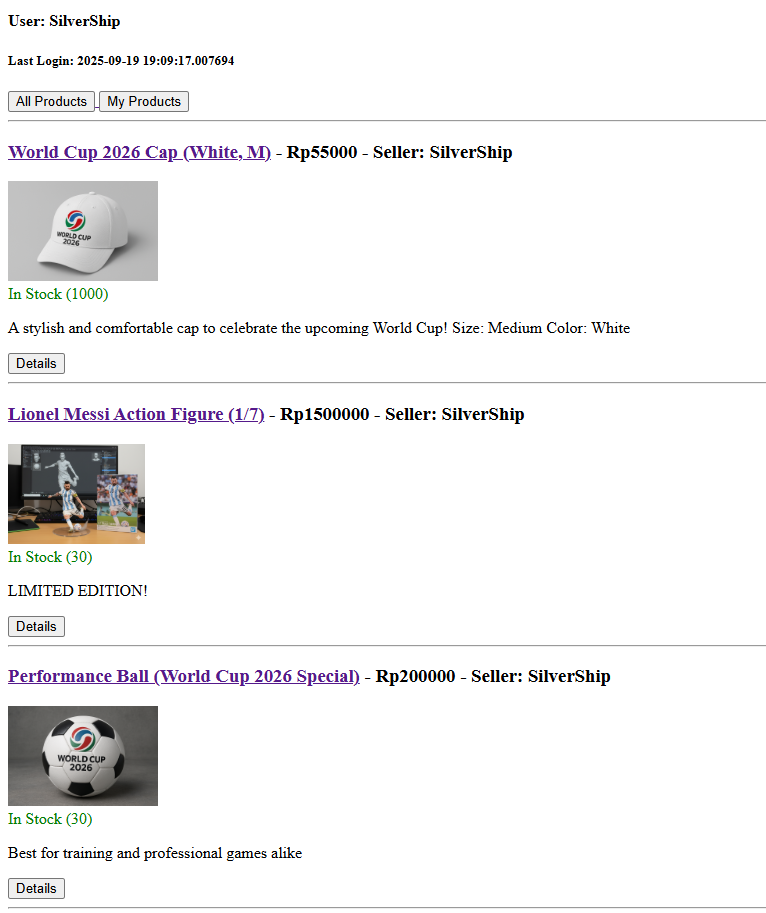

    SigmaBalls

    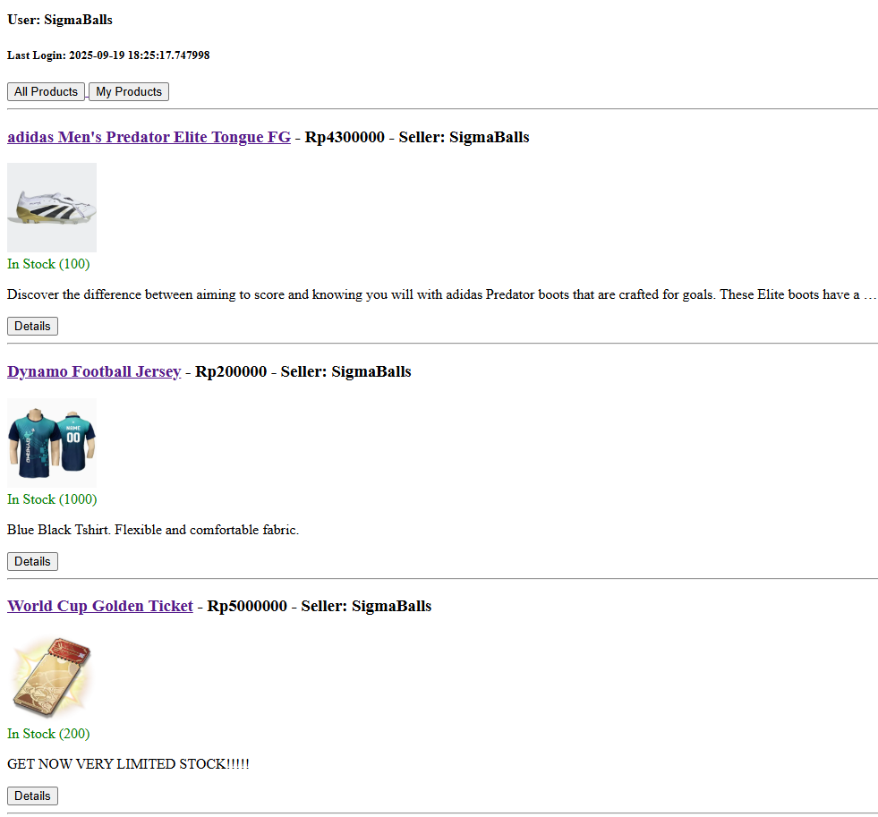

#### **> Menampilkan detail informasi pengguna yang sedang logged in seperti username dan menerapkan _cookies_ seperti `last_login` pada halaman utama aplikasi.**

-   Memodifikasi fungsi `login_user` di [`main/views.py`](main/views.py) untuk mengirimkan sebuah _cookie_ `last_login` ke klien, serta `logout_user` agar menghapus _cookie_ tersebut.

-   Memodifikasi [`main/templates/main.html`](main/templates/main.html) untuk menampilkan nama pengguna yang saat ini login serta isi dari _cookie_ `last_login`.

    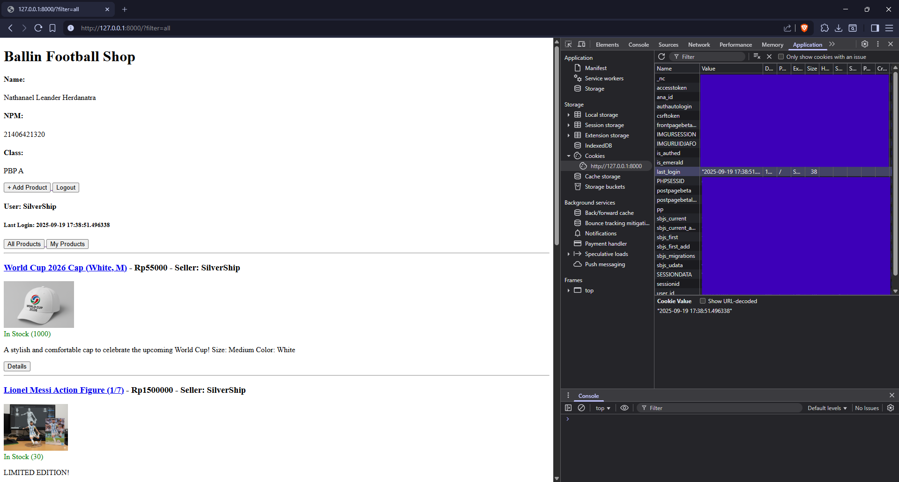

</details>

<details>
<summary><h2><b>Jawaban Pertanyaan Tugas 5</b></h2></summary>

### **Jika terdapat beberapa _CSS selector_ untuk suatu elemen HTML, jelaskan urutan prioritas pengambilan _CSS selector_ tersebut!**

Dalam CSS, terdapat aturan yang dinamakan _CSS specificity_, yang merupakan algoritma penentuan _style declaration_ mana yang diprioritaskan untuk dipakai di suatu elemen. Secara umum, aturan prioritas yang dipakai adalah sebagai berikut.

-   Aturan yang diterapkan lebih akhir adalah yang memiliki prioritas lebih tinggi.
-   _ID selector_ memiliki prioritas lebih tinggi daripada _attribute selector_.
-   _Class selector_ memiliki prioritas lebih tinggi daripada _element selector_.
-   _Universal selector_ tidak berpengaruh pada penentuan prioritas.
-   _Inline style sheet_ lebih spesifik daripada _external style sheet_ sehingga lebih diprioritaskan.
-   Penerapan tag `!important` menyebabkan aturan tersebut di-_override_ sehingga mengatasi prioritas sudah pasti akan diterapkan.

Berdasarkan "aturan main" tersebut, urutan pengambilan _CSS selector_ adalah sebagai berikut.

-   Prioritaskan aturan yang diberi tag `!important`...
-   ... lalu _inline styles_ ...
-   ... selanjutnya _ID selector_ ...
-   ... dilanjutkan oleh _classes_, _attribute selectors_, dan _pseudo-classes_ ...
-   ... lalu _elements_ dan _pseudo-elements_ ...
-   ... terakhir dengan prioritas terendah adalah _universal selectors_ dan `:where()`.

[Referensi](https://www.w3schools.com/css/css_specificity.asp)

### **Mengapa _responsive design_ menjadi konsep yang penting dalam pengembangan aplikasi web? Berikan contoh aplikasi yang sudah dan belum menerapkan responsive design, serta jelaskan mengapa!**

_Responsive design_ memastikan aplikasi web memiliki tampilan menarik dan memiliki usabilitas tinggi di berbagai tipe perangkat, sehingga dapat menarik minat pengguna menggunakan aplikasi karena memiliki pengalaman yang konsisten dan sesuai dengan karakteristik perangkat yang digunakan.

_Responsive design_ adalah tentang menggunakan HTML dan CSS untuk secara otomatis mengubah ukuran, menyembunyikan, mengecilkan, atau memperbesar sebuah situs web, untuk membuatnya terlihat bagus di semua perangkat (desktop, tablet, dan ponsel/mobile).

Contoh aplikasi web yang menerapkan _responsive design_ adalah situs-situs media sosial seperti [X](https://x.com) dan [Instagram](https://instagram.com). Dikarenakan aplikasi tersebut umum diakses di berbagai tipe perangkat mulai dari desktop hingga mobile, maka perlu adanya desain responsif untuk memastikan kenyamanan pengguna di berbagai platform. Responsivitas ini terlihat dari ukuran font yang berubah menyesuaikan ukuran _viewport_, serta bentuk menu yang menyesuaikan.

Contoh yang belum menerapkan _responsive design_ adalah situs web yang dibuat menggunakan teknologi lama seperti [The Big Ugly Website](https://thebiguglywebsite.com/). Karena dibuat dengan teknologi web terdahulu yang diciptakan sebelum era perangkat mobile, responsivitas bukan merupakan prioritas dalam website ini.

### **Jelaskan perbedaan antara _margin_, _border_, dan _padding_, serta cara untuk mengimplementasikan ketiga hal tersebut!**

_Margin_, _border_, dan _padding_ merupakan bagian inti dari CSS Box Model, sebuah konsep yang menyatakan bahwa setiap elemen HTML dianggap sebagai sebuah kotak persegi. Memahami ketiganya sangat penting untuk mengatur tata letak dan jarak antar elemen pada halaman web.

Secara konseptual, perbedaan utama terletak pada posisi mereka relatif terhadap konten elemen. _Padding_ adalah ruang transparan yang berada di dalam batas elemen, yaitu antara konten (seperti teks atau gambar) dan _border_. Menambahkan _padding_ akan mendorong _border_ menjauh dari konten, seolah-olah memberikan ruang bernapas bagi konten di dalam kotaknya. Sebaliknya, _margin_ adalah ruang transparan yang berada di luar batas elemen. Fungsinya adalah untuk menciptakan jarak antara elemen tersebut dengan elemen lain di sekitarnya. Dengan kata lain, _margin_ mendorong seluruh kotak elemen menjauh dari elemen tetangganya.

Di antara _padding_ dan _margin_, terdapat _border_. _Border_ adalah garis yang secara harfiah menjadi batas atau bingkai dari sebuah elemen. Tidak seperti _padding_ dan _margin_ yang selalu transparan, _border_ memiliki properti visual yang bisa diatur, seperti ketebalan (`width`), gaya (`style`, contohnya `solid`, `dashed`, `dotted`), dan warna (`color`). _Border_ inilah yang memisahkan area _padding_ di dalam dengan area _margin_ di luar. Analogi yang paling mudah adalah sebuah bingkai foto: foto adalah konten, ruang putih antara foto dan bingkai adalah _padding_, bingkai itu sendiri adalah _border_, dan jarak antara bingkai tersebut dengan bingkai lain di dinding adalah _margin_.

Untuk mengimplementasikannya, dapat digunakan properti CSS yang ditargetkan pada elemen HTML tertentu. Setiap sisi dapat diatur secara individual (misalnya `padding-top`, `margin-left`) atau menggunakan properti singkat (shorthand) untuk mengatur beberapa sisi sekaligus. Properti singkat ini sangat efisien dan umum digunakan. Untuk _border_, perlu didefinisikan setidaknya ketebalan, gaya, dan warna agar dapat terlihat di halaman.

### **Jelaskan konsep _flexbox_ dan _grid layout_ beserta kegunaannya!**

_Flexbox_, atau secara resmi disebut _Flexible Box Layout_, adalah model tata letak (_layout_) satu dimensi yang dirancang untuk mengatur, menyelaraskan, dan mendistribusikan ruang di antara item-item dalam sebuah wadah (_container_), bahkan ketika ukurannya tidak diketahui atau dinamis. Konsep utamanya adalah satu dimensi, yang berarti _flexbox_ bekerja secara efektif pada satu sumbu saja pada satu waktu, baik secara baris (horizontal) maupun kolom (vertikal). Kegunaan utama _flexbox_ adalah untuk tata letak komponen dan elemen-elemen di dalamnya. Sangat ideal untuk membuat _navigation bar_, menyusun item dalam sebuah kartu (_card_), atau memusatkan elemen secara vertikal dan horizontal dengan mudah—tugas-tugas yang secara historis sulit dilakukan dengan metode CSS tradisional seperti `float`. Dengan properti seperti `justify-content` dan `align-items`, pengembang dapat dengan mudah mengontrol perataan dan spasi item di sepanjang sumbu utama dan sumbu silang.

Di sisi lain, _grid layout_ adalah model tata letak dua dimensi yang lebih kuat, dirancang untuk menangani tata letak halaman secara keseluruhan. Berbeda dengan _flexbox_ yang berorientasi pada satu sumbu, _grid_ memungkinkan pengembang untuk mengontrol tata letak baik dalam baris maupun kolom secara bersamaan. Konsep ini memungkinkan pembuatan struktur yang kompleks dan responsif dengan lebih presisi dan kode yang lebih sedikit. Penggunaannya sangat ideal untuk merancang tata letak utama halaman web, seperti menempatkan _header_, _sidebar_, konten utama, dan _footer_. _Grid_ juga sangat cocok untuk membuat galeri gambar, kalender, atau antarmuka apa pun yang secara alami berbentuk kisi-kisi. Properti seperti `grid-template-columns` dan `grid-template-rows` memberikan kontrol penuh atas ukuran dan jumlah lajur, sementara `gap` memudahkan pengaturan jarak antar elemen.

### **Proses Implementasi _Step-by-Step_**

#### **> Membuat fungsi menghapus dan mengedit produk**

Hal pertama yang dilakukan adalah menambahkan metode `edit_product` dan `delete_product` di [`views.py`](main/views.py) dan melakukan routing kedua metode itu di [`urls.py`](main/urls.py). Setelah itu, untuk antarmuka pengeditan produk, buat file HTML yaitu [`edit_product.html`](main/templates/edit_product.html) dengan isi yang kurang lebih sama dengan [`add_product.html`](main/templates/add_product.html).

#### **> Persiapan kustomisasi halaman web**

Kustomisasi web dilakukan menggunakan _framework_ CSS [Bootstrap](https://getbootstrap.com/). Untuk melakukannya, pada [`base.html`](templates/base.html), tepatnya pada bagian `head`, tambahkan _stylesheet_ dan _script_ Bootstrap serta load file statik (gambar dan grafik yang diperlukan) dan CSS global.

Untuk file statik, buat folder [`static`](static) yang berisi CSS global [`global.css`](static/css/global.css) dan gambar yang akan digunakan.

Setelah itu, pada [`settings.py`](ballin/settings.py), definisikan _middleware_ WhiteNoise serta lokasi file statik yang digunakan.

Referensi yang digunakan sepanjang proses kustomisasi dapat dilihat [di sini](https://getbootstrap.com/docs/5.3/).

#### **> Pembuatan _navigation bar_ dan _hamburger menu_**

Untuk pembuatan _navigation bar_ yang dapat bertransformasi menjadi _hamburger menu_ jika ukuran layar mengecil (misal pada tampilan mobile), gunakan kelas `navbar` dan `offcanvas` yang disediakan oleh Bootstrap. Implementasi navbar ini menampilkan logo aplikasi, serta link untuk ke _homepage_ dan menu _add product_, dan di sisi sebelahnya menampilkan nama pengguna yang saat ini login, waktu login terakhir, dan tombol logout. Implementasi diterapkan di [`navbar.html`](main/templates/navbar.html).

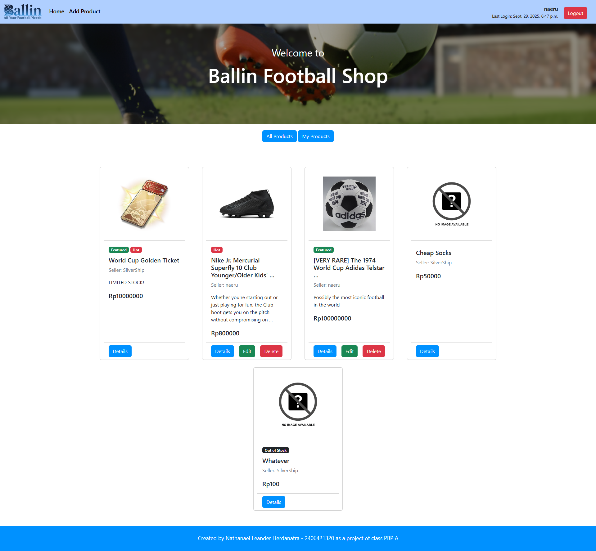

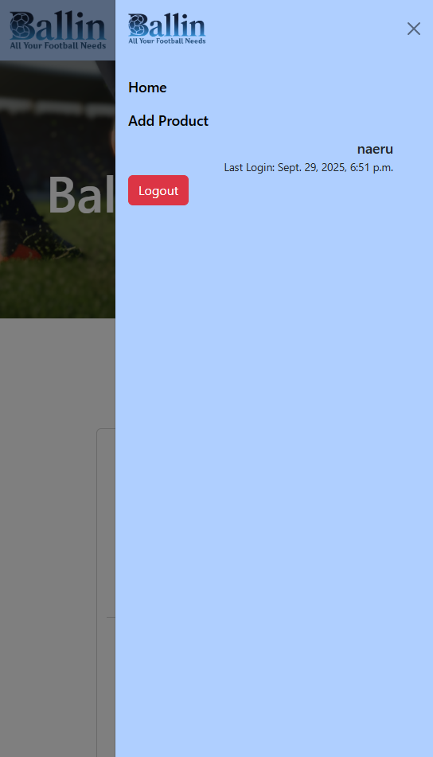

#### **> Kustomisasi halaman login dan register**

Kustomisasi ini membuat _form_ tampil di tengah layar dan logo aplikasi ditampilkan di atas _form_. Isian _form_ diterapkan menggunakan elemen `label` dan `input`, untuk tombol dilakukan dengan kelas `btn` yang disediakan Bootstrap. Implementasi diterapkan di [`login.html`](main/templates/login.html) dan [`register.html`](main/templates/register.html).

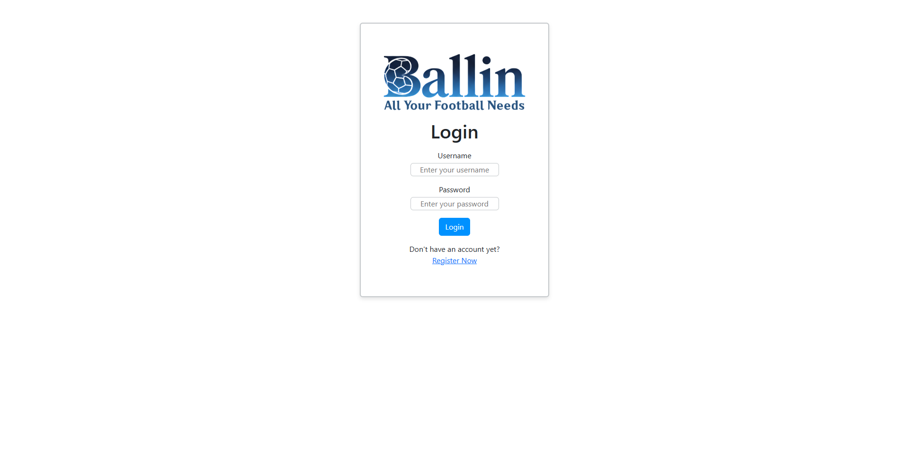
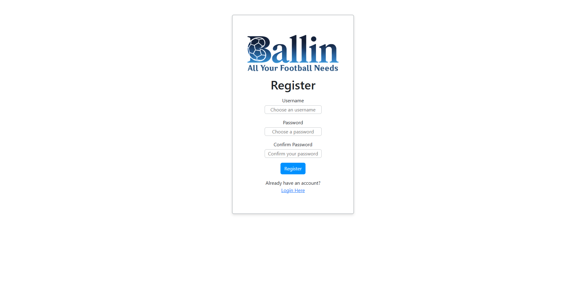

#### **> Kustomisasi _homepage_ dan _product cards_**

Langkah pertama adalah membuat tampilan produk berupa _card_ yang dibuat menggunakan kelas `card` bawaan Bootstrap, dengan elemen berupa gambar _thumbnail_, _badge_ untuk keterangan tambahan produk (_featured_, _hot_, dan _out of stock_), informasi nama, penjual, deskripsi, dan harga produk, serta tombol-tombol untuk membuka halaman detail, edit, dan hapus produk. Implementasi diterapkan di [`card.html`](main/templates/card.html).

Selanjutnya, untuk _homepage_, tambahkan navbar yang sudah kita buat sebelumnya, tampilkan _header_ berisi gambar latar belakang serta pesan _welcome_, 2 tombol untuk _filtering_ produk, area untuk daftar _card_ produk, serta _footer_ berisi data nama, NPM, dan kelas. Implementasi diterapkan di [`main.html`](main/templates/main.html).


Jika tidak ada produk yang ditampilkan, tampilkan gambar statis [`nothing.png`](static/images/nothing.png) di area produk serta pesan bahwa saat ini masih belum ada produk yang bisa ditampilkan.

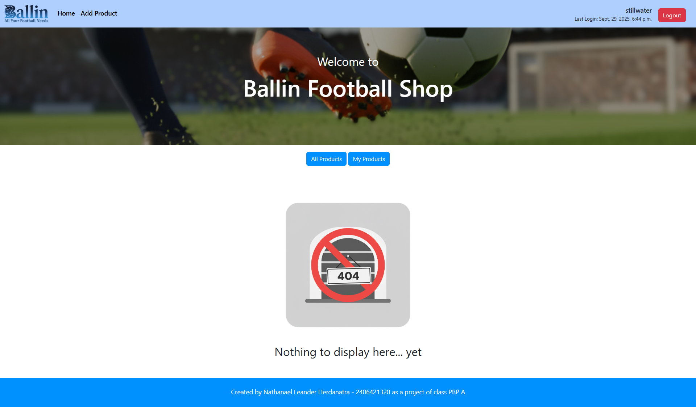

#### **> Kustomisasi tampilan detail produk**

Kustomisasi meliputi inklusi _navbar_, penambahan tombol kembali ke menu utama, serta tampilan deskripsi produk berupa dua kolom, satu berupa gambar _thumbnail_, satunya berupa deskripsi produk. Implementasi diterapkan di [`product_detail.html`](main/templates/product_detail.html).

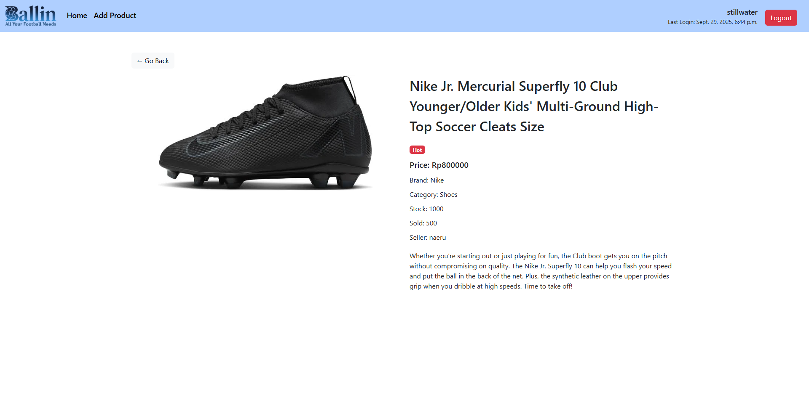

#### **> Kustomisasi tampilan tambah dan edit produk**

Kustomisasi meliputi inklusi _navbar_, penambahan tombol kembali ke menu utama, form input yang diperbarui di mana elemennya bersifat rata tengah dan selebar _viewport_ (didefinisikan di [`global.css`](static/css/global.css)), serta tombol _submit_ yang diperbarui. Implementasi diterapkan di [`add_product.html`](main/templates/add_product.html) dan [`edit_product.html`](main/templates/edit_product.html).

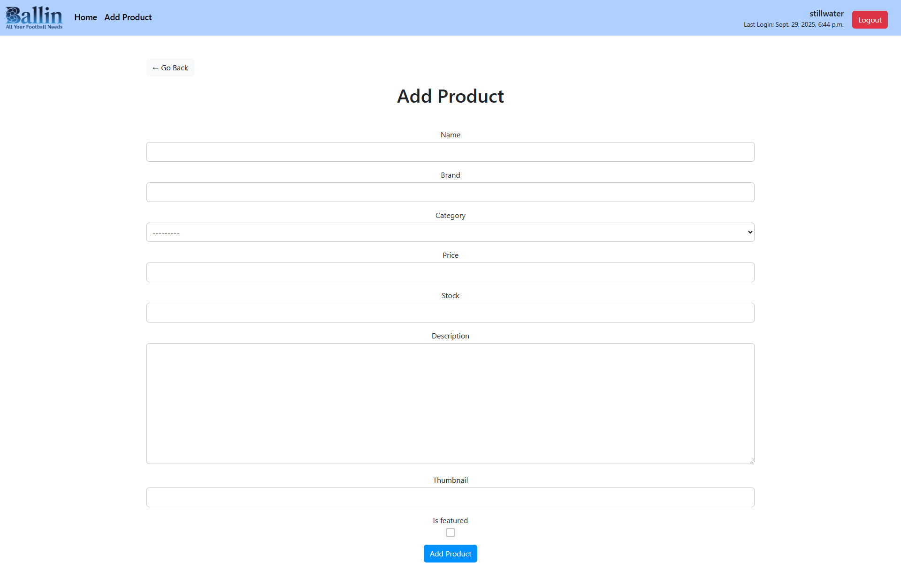
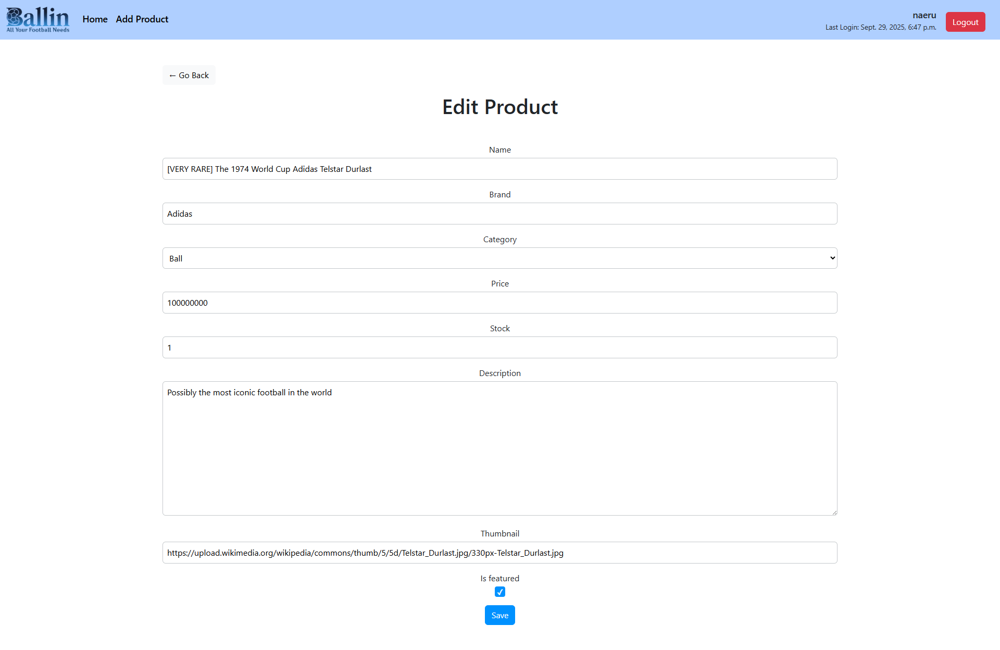

</details>

<details>
<summary><h2><b>Jawaban Pertanyaan Tugas 6</b></h2></summary>

### **Apa perbedaan antara _synchronous request_ dan _asynchronous request_?**

_Synchronous request_ adalah request yang ketika dikirimkan, selama request itu masih dalam proses pengiriman, proses lain yang dilakukan pada klien akan diblok (tidak dijalankan) hingga proses request selesai. Dengan demikian, eksekusi proses berikutnya harus menunggu proses tersebut selesai dilaksanakan terlebih dahulu, sehingga prosesnya lebih lambat namun teratur.

_Asynchronous request_ adalah request yang ketika dikirimkan, tidak akan memblok proses lain yang dijalankan bersamaan dengan request itu. Dengan demikian, eksekusi proses berikutnya tidak perlu menunggu proses tersebut selesai dilaksanakan terlebih dahulu dan bisa langsung dieksekusi, sehingga meningkatkan _throughput_ yang disebabkan beberapa proses berjalan pada suatu waktu.

[Referensi](https://www.mendix.com/blog/asynchronous-vs-synchronous-programming/)

### **Bagaimana AJAX bekerja di Django (alur request–response)?**

-   Request diawali dengan terjadinya suatu event di halaman web (seperti menekan tombol atau pengisian form) yang memicu suatu fungsi yang ada di kode JavaScript halaman web.
-   Fungsi JavaScript ini membuat suatu _asynchronous request_ dengan membuat objek `XMLHttpRequest` atau menggunakan `Fetch` API. Request ini kemudian diteruskan ke URL tertentu yang telah didaftarkan di `urls.py`.
-   Di sisi server, `urls.py` akan meneruskan permintaan ini ke fungsi _view_ yang sesuai. _View_ tersebut akan memproses permintaan, berinteraksi dengan models atau database jika diperlukan, dan kemudian mengembalikan respons dalam format data seperti JSON atau XML, bukan merender template HTML penuh.
-   Setelah klien menerima respons ini, fungsi JavaScript yang sama akan memproses data tersebut dan secara dinamis memperbarui bagian tertentu dari halaman HTML menggunakan manipulasi DOM, sehingga tidak perlu dilakukan _refresh_ halaman secara keseluruhan.

### **Apa keuntungan menggunakan AJAX dibandingkan render biasa di Django?**

Penggunaan AJAX memungkinkan pembaruan konten halaman web diapat dilakukan secara dinamis tanpa perlu melakukan _refresh_ halaman web secara penuh, sehingga meningkatkan pengalaman pengguna dan efisiensi. Karena data yang dikirimkan antara klien dan server umumnya berukuran lebih kecil (misal berupa JSON alih-alih keseluruhan halaman HTML), hal ini dapat mengurangi waktu tunggu pengiriman dan pemrosesan, beban kerja, dan _bandwidth_ data yang dikirimkan, sehingga dapat meningkatkan efisiensi aplikasi, yang sangat membantu terutama oleh pengguna dengan perangkat atau koneksi internet yang terbatas.

### **Bagaimana cara memastikan keamanan saat menggunakan AJAX untuk fitur Login dan Register di Django?**

Berikut merupakan langkah-langkah yang bisa dilakukan.

-   Memastikan koneksi yang digunakan untuk login/register adalah HTTPS yang merupakan koneksi yang aman karena mengenkripsi semua data yang dikirimkan antara klien dan server.
-   Menerapkan perlindungan terhadap serangan CSRF dengan menggunakan fitur CSRF token yang disediakan oleh Django
-   Di sisi server, validasi data masukan harus dilakukan secara ketat untuk mencegah serangan seperti _SQL injection_.
-   Penting untuk tidak pernah menampilkan pesan error yang terlalu detail yang dapat memberikan petunjuk kepada penyerang. Cukup tampilkan pesan yang umum seperti "Username atau password salah" yang mencakup kedua kasus alih-alih menampilkan "Username salah" atau "Password salah" untuk dua kasus berbeda. Dengan demikian, penyerang tidak dapat mengetahui input yang salah itu di bagian username, password, atau keduanya.

### **Bagaimana AJAX mempengaruhi pengalaman pengguna (User Experience) pada website?**

AJAX secara fundamental mengubah pengalaman pengguna dengan membuat aplikasi web terasa lebih lancar, cepat, dan interaktif, mirip seperti aplikasi desktop. Dengan menghilangkan kebutuhan untuk memuat ulang halaman secara penuh setiap kali pengguna melakukan aksi, AJAX mengurangi waktu tunggu yang mengganggu dan memberikan umpan balik instan. Misalnya, saat pengguna mengisi formulir, validasi data dapat dilakukan secara real-time tanpa harus mengirimkan seluruh formulir terlebih dahulu. Pengalaman yang lebih mulus dan responsif ini secara langsung meningkatkan kepuasan pengguna dan membuat mereka lebih mungkin untuk terus berinteraksi dengan website tersebut.

### **Proses Implementasi _Step-by-Step_**

-   Langkah pertama yang diterapkan adalah implementasi notifikasi toast yang akan muncul ketika proses login, register, dan logout, serta ketika penambahan, update, dan penghapusan produk. Implementasi terdapat di [`toast.html`](main/templates/toast.html) dengan _driver code_-nya di [`toast.js`](static/js/toast.js).

-   Selanjutnya, perbarui login dan register untuk menerapkan AJAX. Pembaruan ini meliputi perubahan di [`login.html`](main/templates/login.html) dan [`register.html`](main/templates/register.html) untuk melakukan submisi secara asinkronus dan menampilkan toast setelah proses dilaksanakan. Untuk itu, perlu dibuat kode JS untuk masing-masing halaman yaitu [`login.js`](static/js/login.js) dan [`register.js`](static/js/register.js). Selain itu, ubah [`navbar.html`](main/templates/navbar.html) untuk membuat tombol logout menampilkan toast ketika diklik.

-   Perubahan selanjutnya adalah pada halaman utama produk. Daftar produk ditampilkan secara asinkronus menggunakan AJAX, dan elemen _card_ setiap produk dibangun dengan teknologi JavaScript. Diterapkan juga _loading_, _empty_, dan _error state_ pada halaman utama, juga tombol _refresh_ untuk memperbarui daftar produk secara dinamis tanpa _full refresh_ dari browser, juga tombol baru untuk menambahkan produk dengan AJAX (melalui _modal dialog_). Referensi: [`main.html`](main/templates/main.html) dan [`main.js`](static/js/main.js).

-   Perubahan juga terjadi di halaman detail produk. Tampilan produk diubah menjadi dinamis dengan AJAX, diterapkan _loading_ dan _error state_, adanya tombol Edit dan Delete pada halaman detail jika user produk sama dengan user yang saat ini login, serta adanya formatting pada tampilan harga. Referensi: [`product_detail.html`](main/templates/product_detail.html) dan [`product.js`](static/js/product.js).

-   Modal konfirmasi untuk menghapus produk diterapkan di [`delete_modal.html`](main/templates/delete_modal.html) dengan kelas `modal` bawaan Bootstrap. Logikanya diterapkan di [`main.js`](static/js/main.js).

-   Add Product dengan AJAX diterapkan melalui pembuatan modal di [`add_product_modal.html`](main/templates/add_product_modal.html) dengan _driver code_-nya di [`add_product_modal.js`](static/js/add_product_modal.js). Perlu ada penambahan fungsi `add_product_ajax` di [`views.py`](main/views.py) beserta routingnya di [`urls.py`](main/urls.py) untuk menangani ini.

-   Edit Product dengan AJAX diterapkan melalui pembuatan modal di [`edit_product_modal.html`](main/templates/edit_product_modal.html). Logikanya diterapkan di [`main.js`](static/js/main.js). Perlu ada penambahan fungsi `edit_product_ajax` di [`views.py`](main/views.py) beserta routingnya di [`urls.py`](main/urls.py) untuk menangani ini.

</details>
