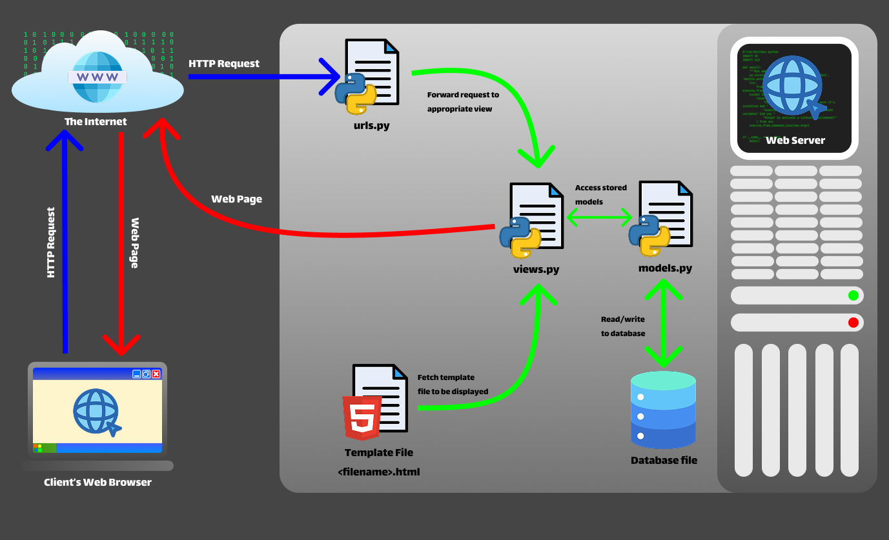
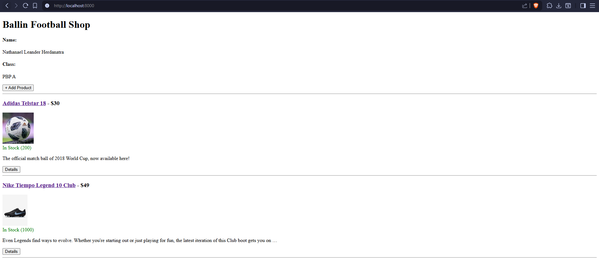
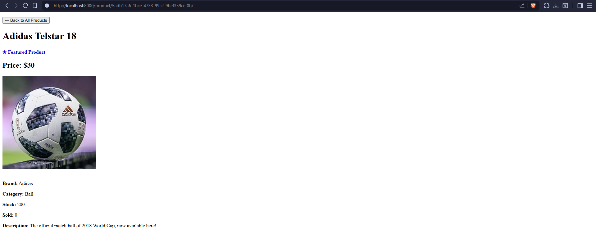
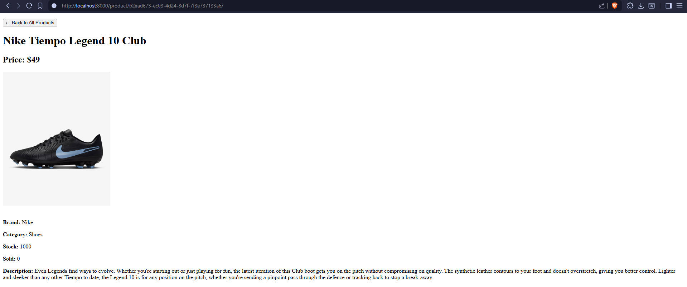
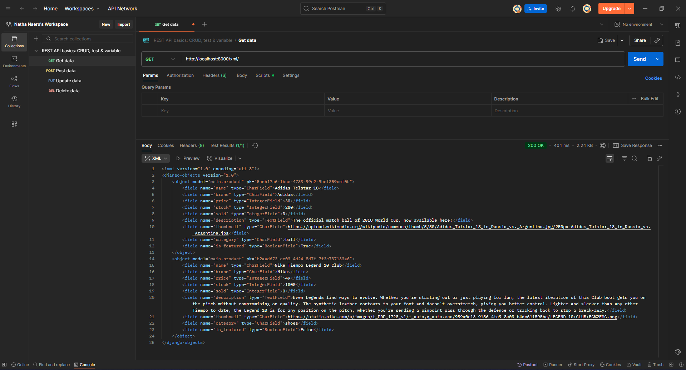
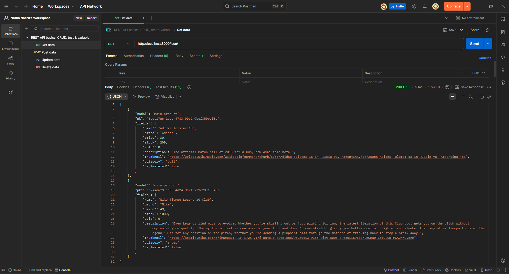
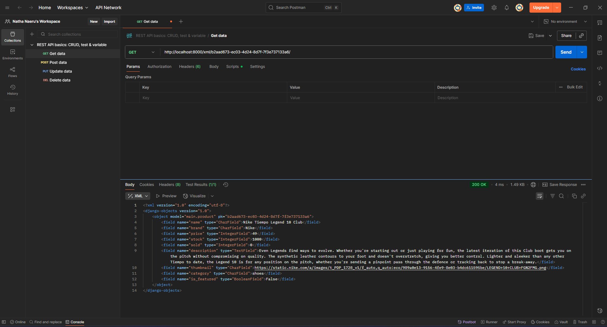
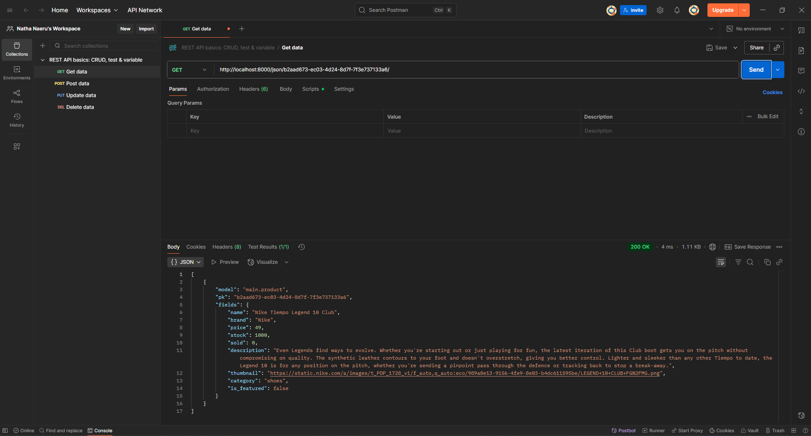

# **Ballin: An Online Football Shop**

_**DISCLAIMER**: Repositori ini dibuat untuk rangkaian tugas individu mata kuliah Pemrograman Berbasis Platform Ilmu Komputer Universitas Indonesia, atas nama Nathanael Leander Herdanatra, NPM 2406421320. Aplikasi yang terdapat di repositori ini merupakan simulasi dan bukan toko online asli._

## **Overview**

Projek ini adalah _web app_ untuk aplikasi toko sepak bola _online_ berbasis web yang menggunakan _framework_ Django.

_Deployment link_: [https://nathanael-leander-ballin.pbp.cs.ui.ac.id/](https://nathanael-leander-ballin.pbp.cs.ui.ac.id/)

Saat ini, _website_ menampilkan daftar produk yang bisa ditambah oleh pengguna.

## **Jawaban Pertanyaan Tugas 2**

### **Proses Implementasi _Step-by-Step_**

Berikut merupakan langkah-langkah yang ditempuh untuk mengimplementasikan Django dalam pembuatan proyek ini.

#### **> Membuat proyek Django baru**

-   Menginisialisasi lingkungan virtual (_virtual environment_) Python sebagai _runtime_ pengembangan aplikasi.

    ```powershell
    python -m venv env
    env\Scripts\activate
    ```

-   Melakukan instalasi library-library Python yang diperlukan (didefinisikan dalam file [`requirements.txt`](requirements.txt)).

    ```powershell
    pip install -r requirements.txt
    ```

-   Melakukan inisialisasi proyek Django baru.

    ```powershell
    django-admin startproject ballin .
    ```

-   Menginisialisasi file `.env` (_environment variables_ repositori lokal) dan `.env.prod` (_environment variables_ untuk*production deployment*) yang berisi konfigurasi kredensial dan variabel-variabel yang diperlukan untuk berinteraksi dengan _database_.
-   Memodifikasi [`ballin/settings.py`](ballin/settings.py) untuk menggunakan _environment variables_ yang sudah didefinisikan sebelumnya, serta konfigurasi _localhost_ dan _database_.

    ```python
    ...

    import os
    from dotenv import load_dotenv

    # Load environment variables from .env file
    load_dotenv()

    ...

    PRODUCTION = os.getenv("PRODUCTION", "False").lower() == "true"

    # SECURITY WARNING: don't run with debug turned on in production!
    DEBUG = True

    ALLOWED_HOSTS = ["localhost", "127.0.0.1", "nathanael-leander-ballin.pbp.cs.ui.ac.id"]

    ...

    # Database configuration
    if PRODUCTION:
        # Production: gunakan PostgreSQL dengan kredensial dari environment variables
        DATABASES = {
            "default": {
                "ENGINE": "django.db.backends.postgresql",
                "NAME": os.getenv("DB_NAME"),
                "USER": os.getenv("DB_USER"),
                "PASSWORD": os.getenv("DB_PASSWORD"),
                "HOST": os.getenv("DB_HOST"),
                "PORT": os.getenv("DB_PORT"),
                "OPTIONS": {"options": f"-c search_path={os.getenv('SCHEMA', 'public')}"},
            }
        }
    else:
        # Development: gunakan SQLite
        DATABASES = {
            "default": {
                "ENGINE": "django.db.backends.sqlite3",
                "NAME": BASE_DIR / "db.sqlite3",
            }
        }

    ...
    ```

-   Melakukan migrasi _database_ pertama kali untuk memastikan konfigurasi _database_ sudah di-_update_.

    ```powershell
    python manage.py migrate
    ```

#### **> Membuat aplikasi `main` pada proyek**

-   Dilakukan dengan melakukan inisialisasi `main` pada proyek yang akan menghasilkan direktori baru.

    ```powershell
    python manage.py startapp main
    ```

-   Mendaftarkan aplikasi `main` pada proyek dengan memodifikasi _line_ berikut pada [`ballin/settings.py`](ballin/settings.py).

    ```python
    ...

    # Application definition

    INSTALLED_APPS = [
        "django.contrib.admin",
        "django.contrib.auth",
        "django.contrib.contenttypes",
        "django.contrib.sessions",
        "django.contrib.messages",
        "django.contrib.staticfiles",
        "main",
    ]

    ...
    ```

#### **> Melakukan routing pada proyek agar dapat menjalankan aplikasi `main`**

-   Melakukan editing pada berkas [`ballin/urls.py`](ballin/urls.py) sebagai berikut. Berkas ini memungkinkan _HTTP request_ dari pengguna dialihkan pada aplikasi `main`.

    ```python
    ...

    from django.contrib import admin
    from django.urls import path, include

    urlpatterns = [
        path("admin/", admin.site.urls),
        path("", include("main.urls")),
    ]
    ```

-   Membuat file [`main/urls.py`](main/urls.py) sebagai rute URL aplikasi `main`. Untuk sementara biarkain file ini kosong dulu.

#### **> Membuat model pada aplikasi `main` dengan nama `Product`**

-   Model didefinisikan di [`main/models.py`](main/models.py) dengan atribut-atribut dan metode-metode yang bisa dilihat di kode Python berikut. Untuk saat ini model dapat diliat langsung pada program yang sudah di-_deploy_.

    ```python
    from django.db import models
    import uuid


    # Create your models here.
    class Product(models.Model):
        id = models.UUIDField(primary_key=True, default=uuid.uuid4, editable=False)
        name = models.CharField()
        brand = models.CharField()
        price = models.IntegerField()
        stock = models.IntegerField()
        sold = models.IntegerField(default=0)
        description = models.TextField()
        thumbnail = models.URLField()
        category = models.CharField()
        is_featured = models.BooleanField(default=False)

        def __str__(self):
            return self.name

        def add_stock(self, quantity):
            self.stock += quantity
            self.save()

        def sell(self, quantity):
            if not self.is_in_stock() or quantity > self.stock:
                raise ValueError("Not enough stock available")
            self.stock -= quantity
            self.sold += quantity
            self.save()

        def is_hot_selling(self):
            return self.sold > 100

        def is_in_stock(self):
            return self.stock > 0

        def change_price(self, new_price):
            if new_price <= 0:
                raise ValueError("Price cannot be zero or negative")
            self.price = new_price
            self.save()
    ```

-   Membuat dan melakukan migrasi model yang sudah diperbarui agar perubahan dapat dilacak.

    ```powershell
    python manage.py makemigrations
    python manage.py migrate
    ```

#### **> Membuat sebuah fungsi pada `views.py` untuk dikembalikan ke dalam sebuah _template_ HTML yang menampilkan nama aplikasi serta nama dan kelas**

-   Fungsi didefinisikan pada [`main/views.py`](main/views.py) yang bertujuan menampilkan konteks data yang akan di-_render_ pada tampilan HTML.

    ```python
    from django.shortcuts import render


    # Create your views here.
    def show_main(request):
        context = {
            "name": "Nathanael Leander Herdanatra",
            "class": "PBP A",
        }

        return render(request, "main.html", context)
    ```

-   _Template_ HTML didefinisikan di berkas [`main/templates/main.html`](main/templates/main.html) dan isinya menampilkan nama aplikasi serta variabel nama dan kelas.

    ```django
    <h1>Ballin Football Shop</h1>

    <h4>Name:</h4>
    <p>{{ name }}</p>
    <h4>Class:</h4>
    <p>{{ class }}</p>
    ```

#### **> Membuat sebuah _routing_ pada `urls.py` aplikasi main untuk memetakan fungsi yang telah dibuat pada `views.py`**

-   Memodifikasi file [`main/urls.py`](main/urls.py) sebagai berikut untuk menyambungkan _request_ ke fungsi `show_main`.

    ```python
    from django.urls import path
    from main.views import show_main

    app_name = "main"

    urlpatterns = [
        path("", show_main, name="show_main"),
    ]
    ```

#### **> Melakukan _deployment_ ke PWS terhadap aplikasi yang sudah dibuat sehingga dapat diakses melalui Internet**

-   Membuat proyek baru di [PWS](https://pbp.cs.ui.ac.id/web) dan di GitHub.
-   Melakukan inisiasi repositori Git lokal.
-   Membuat _branch_ `master` sebagai _branch_ utama proyek.
-   Menghubungkan repositori lokal dengan repositori GitHub dan repositori di PWS.
-   Melakukan _add_, _commit_, dan _push_ ke kedua repositori sehingga perubahannya dapat diakses di GitHub dan _website_ dapat langsung _online_.

### **Bagan Alur _Request Website_ Django**

Berikut merupakan bagan yang berisikan _request client_ ke web aplikasi berbasis Django beserta responsnya.

[_Full image Figma link_](https://www.figma.com/design/nmNjwT86D4c3ofaUFjXISM/Django?node-id=0-1&t=1sdKesRVngFeUump-1)

Penjelasan:

-   Ketika perangkat klien mengakses halaman web melalui _browser_, klien mengirimkan sebuah _HTTP request_ pada Internet berupa URL yang ingin diakses. Sistem DNS akan menterjemahkan URL tersebut menjadi alamat IP _web server_ yang ingin diakses.
-   Setelah _request_ sampai di _web server_, _request_ akan diredireksi oleh `urls.py` untuk diteruskan ke kode tampilan yang bersesuaian. Di sini `urls.py` berfungsi sebagai _router_ yang memetakan _request_ pada _views_ dan perintah yang bersesuaian.
-   _Request_ diproses di pengatur tampilan (`views.py`) yang bersesuaian di masing-masing aplikasi. Dalam Django yang berbasis MVT (_models-views-templates_) `views.py` merupakan kontroler utama untuk fungsi-fungsi aplikasi web.
-   `views.py` mengambil (_fetch_) _template_ berupa berkas HTML yang merupakan tampilan sebenarnya dari halaman web, yang merupakan respons dari _request_ yang diberikan.
-   Untuk mengakses data aplikasi, `views.py` akan mengambil model yang didefinisikan di `models.py`. File model ini dapat berinteraksi dengan _database_ dengan cara membaca dan menulis ke dalamnya.
-   Setelah semua data yang diperlukan siap, `views.py` akan mengirimkan _HTTP response_ ke Internet, untuk kemudian dapat ditampilkan di perangkat klien.

Referensi:

_Django introduction - Learn web development_ | _MDN_. (2024, 19 Desember). MDN Web Docs. https://developer.mozilla.org/en-US/docs/Learn_web_development/Extensions/Server-side/Django/Introduction (Diakses pada 5 September 2025)

Tim Dosen PBP. (nd). "Introduction to the Internet and Web Framework". Fakultas Ilmu Komputer Universitas Indonesia. https://scele.cs.ui.ac.id/pluginfile.php/268491/mod_resource/content/1/02%20-%20Introduction%20to%20the%20Internet%20and%20Web%20Framework.pdf (Diakses pada 5 September 2025)

### **Fungsi `settings.py`**

`settings.py` menyimpan konfigurasi _web server_ Django yang digunakan di sepanjang pengembangan dan eksekusi aplikasi, seperti alamat _host_ yang didefinisikan, referensi ke _database_ yang digunakan, format waktu dan tanggal, aplikasi yang didaftarkan pada proyek, dan lain-lain.

Referensi:

Django Software Foundation. (2025). _Settings_ | _Django documentation_. Django Project. https://docs.djangoproject.com/en/5.2/ref/settings/ (Diakses pada 5 September 2025)

### **Cara kerja migrasi _database_ di Django**

Dalam Django, migrasi adalah cara Django melacak dan mengimplementasi perubahan pada model atau _database_ proyek atau aplikasi. Dapat dikatakan migrasi ini adalah semacam _version control_ untuk skema _database_. Terdapat dua perintah yang umum digunakan dalam proses migrasi, yaitu `makemigrations` dan `migrate`.

Perintah `makemigrations` mengumpulkan perubahan-dperubahan yang terjadi dalam satu file migrasi, sama seperti fungsi `commit` pada aplikasi _version control_ seperti Git. Sementara itu, perintah `migrate`, mengaplikasikan perubahan tersebut pada _database_, anggap seperti perintah `push` yang digunakan pada _database_.

Referensi:

Django Software Foundation. (2025). _Migrations_ | _Django documentation_. Django Project. https://docs.djangoproject.com/en/5.2/topics/migrations/ (Diakses pada 5 September 2025)

### **Mengapa _framework_ Django digunakan untuk permulaan pembelajaran pengembangan perangkat lunak?**

_Framework_ Django digunakan karena berbagai alasan berikut.

-   Django bersifat _open-source_ sehingga dapat digunakan secara bebas tanpa restriksi tertentu.
-   Kemudahan penggunaan. Django berbasis bahasa pemrograman Python yang terkenal memiliki _syntax_ yang sederhana dan mudah digunakan pemula, namun memiliki fungsi-fungsi yang cukup _powerful_.
-   Django memiliki performa tinggi sehingga dapat menciptakan aplikasi web yang responsif dan dapat menangani _traffic_ tinggi.
-   Django memiliki fitur-fitur yang kaya dan dapat membantu memudahkan berbagai keperluan umum dalam _web programming_.
-   Django merupakan platform yang aman, didukung dengan fitur-fitur _security_ yang dimilikinya.
-   Aplikasi Django dapat diskalasi dengan mudah untuk berbagai _platform_.
-   Django dapat digunakan untuk berbagai _use case_, mulai yang sederhana hingga yang lebih kompleks.

Referensi:

Tim Dosen PBP. (nd). "Introduction to the Internet and Web Framework". Fakultas Ilmu Komputer Universitas Indonesia. https://scele.cs.ui.ac.id/pluginfile.php/268491/mod_resource/content/1/02%20-%20Introduction%20to%20the%20Internet%20and%20Web%20Framework.pdf (Diakses pada 5 September 2025)

### **_Feedback_ untuk asisten dosen Tutorial 1**

Kinerja asdos sudah bagus, responsif dalam menjawab permasalahan yang dialami _mentee_ selama sesi tutorial. Pertahankan terus, ya!

## **Jawaban Pertanyaan Tugas 3**

### **Fungsi _data delivery_ dalam pengimplementasian sebuah platform**

Dalam pengimplementasian suatu _platform_, _data delivery_ diperlukan untuk memindahkan data dari satu _platform_ ke _platform_ lainnya untuk keperluan komunikasi antar _platform_. Hal ini sangat krusial dalam pemrograman berbasis _platform_ karena pemrograman ini bersinggungan dengan berbagai macam data, dan adanya metode yang terstandardisasi serta mudah dipahami akan sangat membantu dalam proses komunikasi data, baik dengan sesama pengembang, pengguna, atau komponen program.

### **XML vs JSON**

Dari pendapat penulis dan didukung oleh sumber-sumber lain, JSON merupakan format _data delivery_ yang lebih baik, karena secara _readability_ lebih baik, lebih mudah digunakan, dan menunjukkan hubungan yang jelas antara _key_ dan _value_ yang ada di data tersebut, yang disajikan dalam struktur _map_. Hal ini berbeda dengan XML yang menyimpan data di sebuah _tree_ sehingga secara visual terlihat lebih kompleks.

Selain itu, JSON dapat di-_parse_ lebih mudah dan aman dibandingkan XML, karena JSON dapat di-_parse_ dengan fungsi JavaScript standar, sehingga prosesnya lebih aksesibel dan cepat dibandingkan XML yang membutuhkan _parser_ terpisah. Inilah yang menyebabkan JSON lebih sesuai untuk pengembangan aplikasi _web_ dan _mobile_ yang umumnya dibangun dengan teknologi JavaScript. Selain itu, XML memiliki kerentanan pada strukturnya yang memunculkan risiko keamanan yaitu _XML external entity injection_ (XXE). Hal-hal inilah yang membuat JSON lebih populer dibanding XML dalam pengembangan _software_ modern.

Akan tetapi, XML memiliki dukungan tipe data yang lebih luas dibandingkan JSON, seperti dukungan tipe data biner dan _array_. Oleh karena itu, XML dapat digunakan jika ingin mendukung tipe data yang lebih kompleks.

Referensi:

Amazon Web Services. (2025). _JSON vs. XML - Comparing Data Representations - AWS_. Amazon Web Services, Inc. https://aws.amazon.com/compare/the-difference-between-json-xml/ (Diakses pada 10 September 2025)

## **Metode `is_valid()`**

Metode `is_valid()` digunakan untuk memvalidasi data yang sudah diinput pada _form_. Metode ini mengembalikan `True` jika seluruh data yang diinput valid (sesuai dengan tipe data dan restriksi yang ditetapkan) dan `False` jika ada data yang tidak valid (tidak memenuhi ketentuan). Metode ini diperlukan agar data yang diolah pada proses selanjutnya merupakan data yang benar dan tidak menimbulkan `error` dalam pemrosesannya.

Referensi:

Django Software Foundation. (2021). _The Forms API | Django documentation_. Django Project. https://docs.djangoproject.com/en/5.2/ref/forms/api/#using-forms-to-validate-data (Diakses pada 10 September 2025)

## **Kegunaan `csrf_token`**

`csrf_token` adalah perangkat keamanan yang berfungsi untuk melindungsi suatu _website_ dari tipe serangan siber yang dikenal sebagai _cross-site request forgery_ (CSRF). Jika token ini tidak ada atau tidak didefinisikan pada kode _form_, informasi pengguna berupa _cookies_ dan kredensial lain akan dikirimkan setiap pengguna memberikan _request_ pada aplikasi web. Pelaku serangan CSRF dapat memanfaatkan ini dengan meminta pengguna memberikan _request_ pada halaman web yang memungkinkan pelaku mengakses data pengguna tanpa ketahuan, dengan kondisi pengguna masih terautentikasi pada web tersebut. Hal ini terutama dapat dilakukan menggunakan jenis _request_ yang kurang aman seperti POST, PUT, dan DELETE.

Untuk memitigasi serangan ini, Django memiliki fitur `csrf_token` yaitu token _random_ yang dibuat setiap kali pengguna menjalankan sesi baru. Token ini akan diproses oleh _middleware_ untuk menjadi _cookie_ rahasia yang unik setiap sesinya, serta diberi _masking_. Jika pengguna memberikan _request_ menggunakan metode kurang aman (seperti POST), _form_ input rahasia yang terdefinisikan dalam `` akan mengakses apakah pengguna memiliki _cookie_ rahasia yang sesuai. Jika tidak sesuai, halaman web akan mengembalikan _error_ 403.

Referensi:

Django Software Foundation. (2025). _Cross Site Request Forgery protection | Django documentation_. Django Project. https://docs.djangoproject.com/en/5.2/ref/csrf/ (Diakses pada 10 September 2025)

GeeksforGeeks. (2023, September 26). _CSRF token in Django_. GeeksforGeeks. https://www.geeksforgeeks.org/python/csrf-token-in-django/ (Diakses pada 10 September 2025)

### **Proses Implementasi _Step-by-Step_**

Berikut merupakan langkah-langkah yang ditempuh dalam kelanjutan pembuatan proyek ini.

#### **> Menambahkan 4 fungsi `views` baru untuk melihat objek yang sudah ditambahkan dalam format XML, JSON, XML _by ID_, dan JSON _by ID_.**

-   Memodifikasi [`main/views.py`](main/views.py) untuk menambahkan keempat fungsi tersebut.

    ```python
    ...

    from django.http import HttpResponse
    from django.core import serializers

    ...

    def show_xml(request):
        products = Product.objects.all()
        data = serializers.serialize("xml", products)
        return HttpResponse(data, content_type="application/xml")


    def show_json(request):
        products = Product.objects.all()
        data = serializers.serialize("json", products)
        return HttpResponse(data, content_type="application/json")


    def show_xml_by_id(request, id):
        try:
            product = get_object_or_404(Product, pk=id)
            data = serializers.serialize("xml", [product])
            return HttpResponse(data, content_type="application/xml")
        except Product.DoesNotExist:
            return HttpResponse(status=404)


    def show_json_by_id(request, id):
        try:
            product = get_object_or_404(Product, pk=id)
            data = serializers.serialize("json", [product])
            return HttpResponse(data, content_type="application/json")
        except Product.DoesNotExist:
            return HttpResponse(status=404)
    ```

#### **> Membuat _routing_ URL untuk masing-masing `views` yang telah ditambahkan pada poin 1.**

-   Memodifikasi [`main/urls.py`](main/urls.py) dengan menambahkan masing-masing views tersebut pada `urlpatterns`.

    ```python
    ...

    from main.views import (
        ...
        show_xml,
        show_json,
        show_xml_by_id,
        show_json_by_id,
    )

    ...

    urlpatterns = [
        ...
        path("xml/", show_xml, name="show_xml"),
        path("json/", show_json, name="show_json"),
        path("xml/<uuid:id>/", show_xml_by_id, name="show_xml_by_id"),
        path("json/<uuid:id>/", show_json_by_id, name="show_json_by_id"),
    ]

    ```

#### **> Membuat halaman yang menampilkan data objek model yang memiliki tombol "Add" yang akan redirect ke halaman `form`, serta tombol "Detail" pada setiap data objek model yang akan menampilkan halaman detail objek.**

-   Melakukan modifikasi file [`main/models.py`](main/models.py) agar sesuai ketentuan.
-   Membuat file [`templates/base.html`](templates/base.html) sebagai basis untuk file-file HTML yang akan dibuat setelahnya (mendefinisikan _character set_ UTF-8 dan ukuran _viewport_ seukuran jendela _browser_).
-   Memodifikasi file [`main/templates/main.html`](main/templates/main.html) agar menginheritansi (`extends`) basis yang sudah dibuat di [`templates/base.html`](templates/base.html), serta menambahkan tombol untuk menambahkan produk serta menampilkan data setiap produk yang ada beserta tombol detail pada setiap produknya.

#### **> Membuat halaman `form` untuk menambahkan objek model pada app sebelumnya.**

-   Membuat file [`main/forms.py`](main/forms.py) yang mendefinisikan atribut-atribut apa saja yang dapat dijadikan input _form_.
-   Membuat file [`main/templates/add_product.html`](`main/templates/add_product.html`) sebagai tampilan web dari _form_ input.
-   Membuat _link_ pada tombol yang ada di [`main/templates/main.html`](main/templates/main.html) untuk mengakses _form_.

    ```django
    ...

    <a href="">
        <button>+ Add Product</button>
    </a>

    ...
    ```

-   Membuat fungsi `add_product` pada [`main/views.py`](main/views.py).

    ```python
    ...

    def add_product(request):
        form = ProductForm(request.POST or None)

        if form.is_valid() and request.method == "POST":
            form.save()
            return redirect("main:show_main")

        context = {"form": form}
        return render(request, "add_product.html", context)

    ...
    ```

-   Membuat _routing_ `add_product` pada [`main/urls.py`](main/urls.py)

    ```python
    ...

    from main.views import (
        show_main,
        add_product,
        ...
    )

    ...

    urlpatterns = [
        path("", show_main, name="show_main"),
        path("add-product/", add_product, name="add_product"),
        ...

    ```

#### **> Membuat halaman yang menampilkan detail dari setiap data objek model.**

-   Membuat file [`main/templates/product_detail.html`](`main/templates/product_detail.html`) sebagai tampilan web detail setiap produk.

-   Membuat _link_ pada tombol yang ada di [`main/templates/main.html`](main/templates/main.html) untuk mengakses detail produk.

    ```django
    ...

    
        
            <div>
                ...
                <a href="">
                    <button>Details</button>
                </a>
                <hr>
            </div>
        
    

    ...
    ```

-   Membuat fungsi `show_product` pada [`main/views.py`](main/views.py).

    ```python
    ...

    def show_product(request, id):
        product = get_object_or_404(Product, pk=id)

        context = {
            "product": product,
        }

        return render(request, "product_detail.html", context)

    ...
    ```

-   Membuat _routing_ `show_product` pada [`main/urls.py`](main/urls.py)

    ```python
    ...

    from main.views import (
        ...
        show_product,
        ...
    )

    ...

    urlpatterns = [
        ...
        path("product/<uuid:id>/", show_product, name="show_product"),
        ...

    ```

### **_Feedback_ untuk asisten dosen Tutorial 2**

Kinerja asdos sangat baik, sebelum mulai tutorial memberikan arahan terkait apa yang akan dilakukan dan _review_ tutorial sebelumnya. Pertahankan terus kinerjanya!

### Akses URL dengan Postman

Referensi: Halaman utama website (dibuka di localhost)


Referensi: Halaman produk 1 (bola sepak Adidas)


Referensi: Halaman produk 2 (sepatu bola Nike)


_Request_ XML keseluruhan halaman


_Request_ JSON keseluruhan halaman


_Request_ XML produk Nike


_Request_ JSON produk Nike

